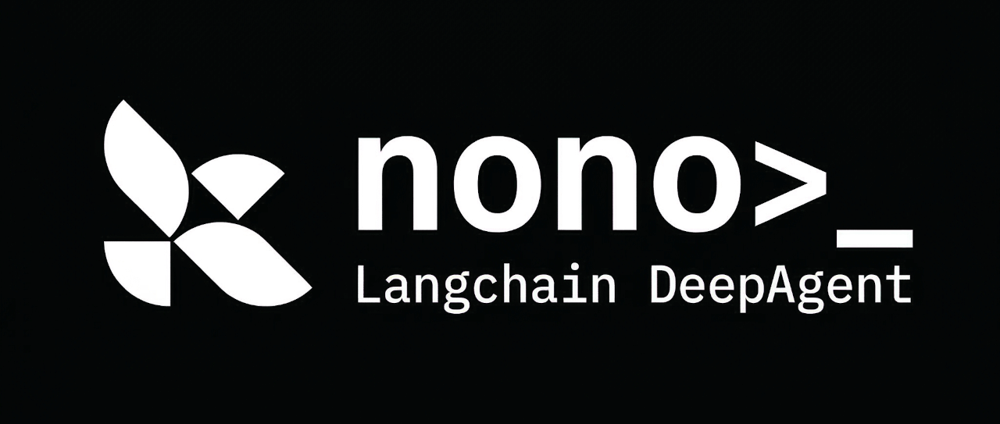

<div align="center">



OS-enforced sandbox backend for [LangChain Deep Agents](https://github.com/langchain-ai/deepagents) using [nono](https://github.com/always-further/nono).

Uses Landlock (Linux) and Seatbelt (macOS) to run agent commands with kernel-enforced filesystem and network restrictions. No containers, VMs, or remote APIs.

</div>

## Installation

```bash
pip install langchain-nono
```

## Usage

```python
from deepagents import create_deep_agent
from langchain_nono import NonoSandbox

sandbox = NonoSandbox(
    working_dir="/tmp/agent-workspace",
    block_network=True,
)

agent = create_deep_agent(
    backend=sandbox,
    system_prompt="You are a coding assistant.",
)
```

## Configuration

```python
sandbox = NonoSandbox(
    working_dir="/tmp/agent-workspace",     # Required: read-write access
    allow_read=["/data/models"],            # Additional read-only paths
    allow_readwrite=["/tmp/scratch"],        # Additional read-write paths
    block_network=True,                     # Block outbound network (default)
    timeout=300,                            # Default command timeout in seconds
)
```

## How it works

Each `execute()` call:

1. Forks the current process
2. Applies OS-level sandbox restrictions in the child (Landlock or Seatbelt)
3. Exec's the command
4. Captures stdout/stderr and waits for exit

The parent process remains unsandboxed and can call `execute()` repeatedly. Sandbox restrictions are enforced by the kernel and cannot be bypassed from userspace.

## Platform support

| Platform | Mechanism | Minimum version |
|----------|-----------|-----------------|
| Linux    | Landlock LSM | Kernel 5.13+ |
| macOS    | Seatbelt | macOS 10.15+ |
